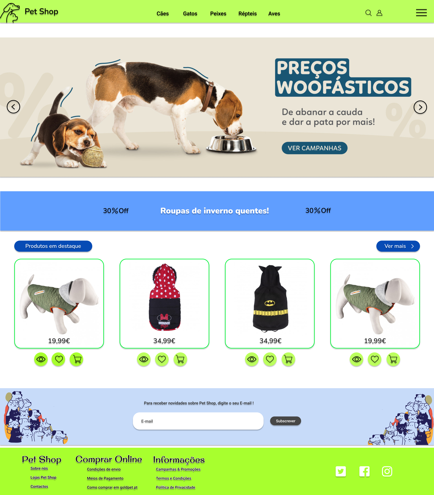
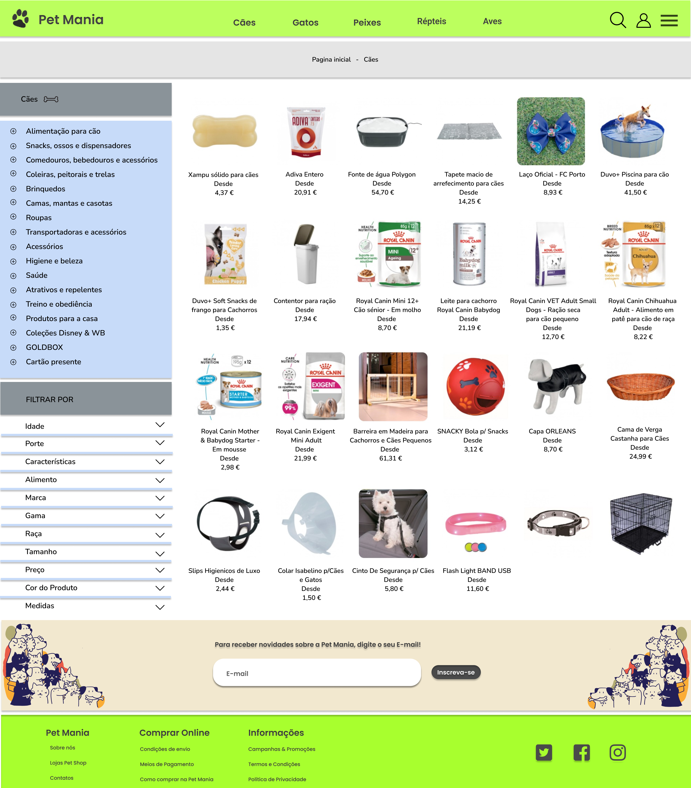
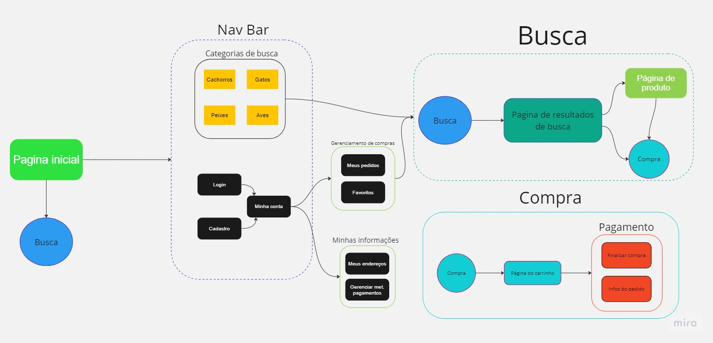

# Pet-Mania (Relatório)

Trabalho da disciplina de *Introdução ao Desenvolvimento Web (SCC0219)* 
Site de um Pet Shop

## Desenvolvedores, Grupo 36:

- Eric Rodrigues das Chagas - 12623971
- Ana Beatriz Araujo Ferreira - 12678044
- Thais Ribeiro Lauriano - 12542518

## Teamplates de design usados

Modelo de site : [https://www.figma.com/file/G90jofNSZqCd0GMdXtR1od/Pet-Shop-(Community)?type=design&node-id=1-2&t=E12cdQYYI5CJ3BU0-0](https://www.figma.com/file/G90jofNSZqCd0GMdXtR1od/Pet-Shop-(Community)?type=design&node-id=1-2&t=E12cdQYYI5CJ3BU0-0)

Modelo com imagens prontas para usar: [https://www.figma.com/file/lcNSEI7O3CVvJQHNKVAVdp/Pet-Shop-Illustrations-(Community)?type=design&node-id=2-3&t=bxD177Xhy9NeSvla-0](https://www.figma.com/file/lcNSEI7O3CVvJQHNKVAVdp/Pet-Shop-Illustrations-(Community)?type=design&node-id=2-3&t=bxD177Xhy9NeSvla-0)

## Requisitos:

- Pagina inicial
- SideBar de login de usuário (e outros)
- Menu de usuário
    - Quizz e seus sistemas
    - Personalização de produtos
    - Carrinho
    - Site de pagamento
- Login Administrador
    - Menu de admin
    - CRUD

## Descrição do projeto:

A partir do figma, vamos usar plugins para gerar o html e css da pagina em questão, em seguida, modificaremos a mesma manualmente para estar clara, adequada, funcional e responsiva (visto que este modo de criação acarretara em diversos erros ao ser feita automaticamente e sem supervisão).

Em seguida, será feito o arquivo do backend em javascript para atender a funcionalidade de “single-page Aplication Style” e demis funcionalidades e nescessidades 

  

### Funcionalidades especificas

- Pagina home de usúario 
- Personalizar coleira produtos
- Sistemas de recomendação de produtos num geral (quizz de recomendação)
    - Ração
    - Caixinhas de transporte
    - Roupinhas
    - etc

## Mockups

### Mockup da pagina inicial do site

### Mockup da pagina de produtos

## Diagrama

## Testes

## Resultados dos testes

## Instalação

## Dificuldades

## Comentários
