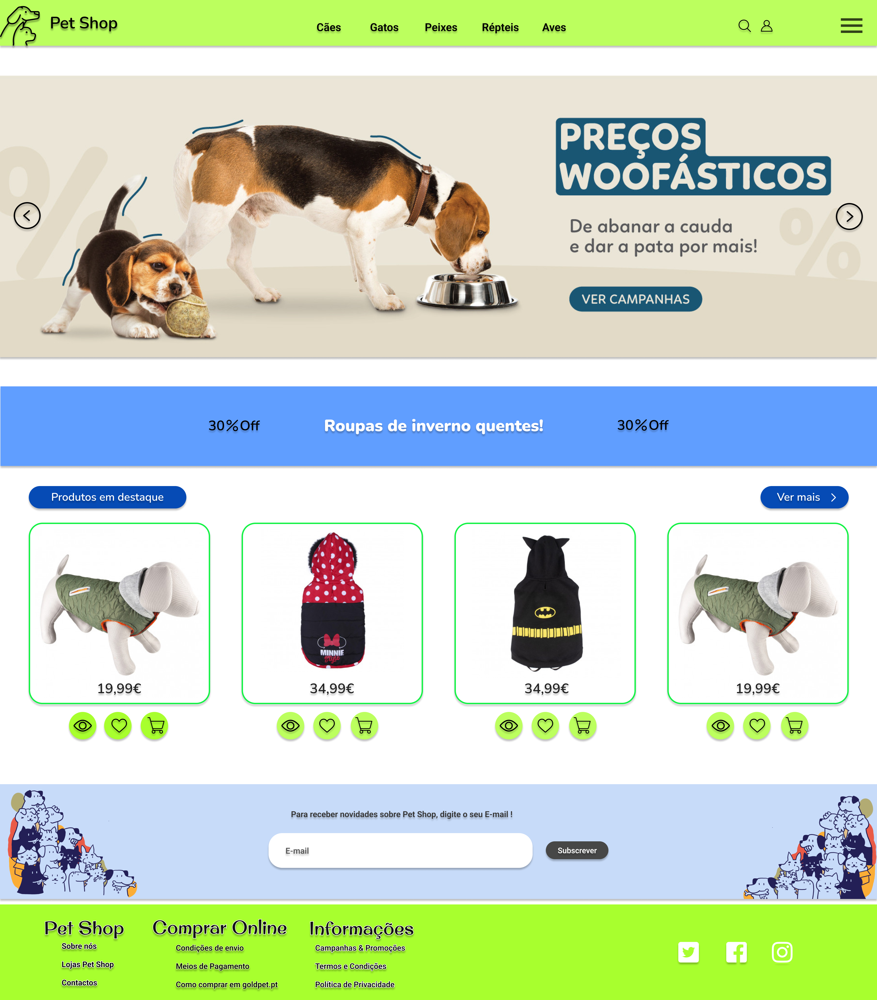
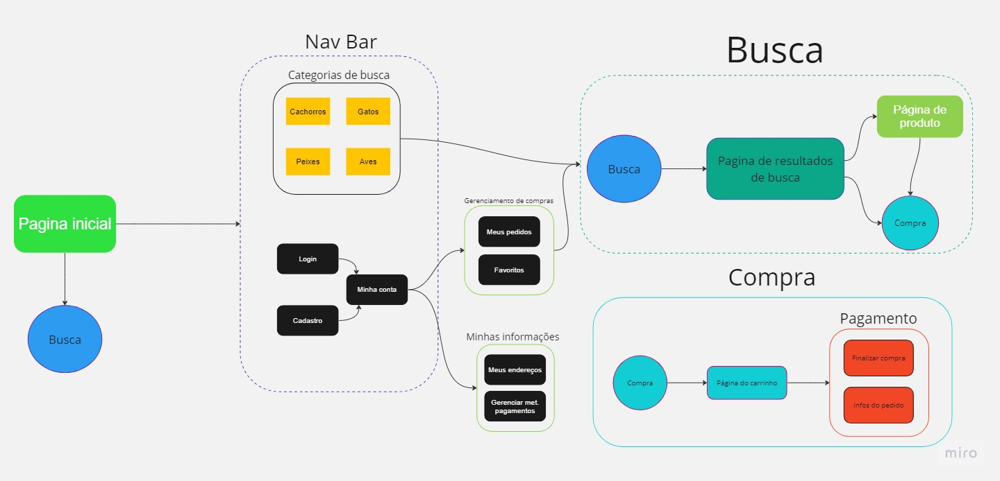

# Pet-Mania (Relatório)

Trabalho da disciplina de *Introdução ao Desenvolvimento Web (SCC0219)* 
Site de um Pet Shop

## Desenvolvedores, Grupo 36:

- Eric Rodrigues das Chagas - 12623971
- Ana Beatriz Araujo Ferreira - 12678044
- Thais Ribeiro Lauriano - 12542518

## Teamplates de design usados

Modelo de site : [https://www.figma.com/file/G90jofNSZqCd0GMdXtR1od/Pet-Shop-(Community)?type=design&node-id=1-2&t=E12cdQYYI5CJ3BU0-0](https://www.figma.com/file/G90jofNSZqCd0GMdXtR1od/Pet-Shop-(Community)?type=design&node-id=1-2&t=E12cdQYYI5CJ3BU0-0)

Modelo com imagens prontas para usar: [https://www.figma.com/file/lcNSEI7O3CVvJQHNKVAVdp/Pet-Shop-Illustrations-(Community)?type=design&node-id=2-3&t=bxD177Xhy9NeSvla-0](https://www.figma.com/file/lcNSEI7O3CVvJQHNKVAVdp/Pet-Shop-Illustrations-(Community)?type=design&node-id=2-3&t=bxD177Xhy9NeSvla-0)

## Requisitos:

- Pagina inicial
- SideBar de login de usuário (e outros)
- Menu de usuário
    - Quizz e seus sistemas
    - Personalização de produtos
    - Carrinho
    - Site de pagamento
- Login Administrador
    - Menu de admin
    - CRUD

## Descrição do projeto:

O projeto desenvolvido na disciplina de Introdução à Web, ministrada pelo professor Dilvan. 
Neste trabalho, foi feita a criação de um website para o Pet-mania, um petshop especializado em produtos para animais de estimação. O foco principal do projeto é permitir que os clientes possam fazer pedidos de coleiras personalizadas para seus animais de estimação.

Ferramentas Utilizadas:
Durante o desenvolvimento do projeto, utilizamos duas ferramentas essenciais: o Figma e o Miro. O Figma foi utilizado para criar o mockup do website, permitindo a visualização e prototipagem das páginas e elementos visuais. Com o Figma, foi possível definir a estrutura e o design do website, garantindo uma experiência amigável para os usuários. Além disso, o Miro foi utilizado para criar o diagrama do projeto, ajudando a organizar as diferentes etapas do desenvolvimento e a colaboração entre os membros da equipe.
  

### Funcionalidades especificas

- Pagina home de usúario 
- Personalizar coleira produtos
- Sistemas de recomendação de produtos num geral (quizz de recomendação)
    - Ração
    - Caixinhas de transporte
    - Roupinhas
    - etc

## Mockups

### Mockup da pagina inicial do site

### Mockup da pagina de produtos

## Diagrama

## Testes

## Resultados dos testes

## Instalação

## Dificuldades
No inicio, optamos por desenvolver os códigos a partir dos codigos gerados pelo figma e depois 
reescrev-los para deixa-los mais organizados porém foi visivel que isto se tornaria uma tarefa
muito dificil de se realizar e tivemos que codar todas as paginas do 0, o que acarretou na falta 
de uma das paginas (no caso, a que contem a funcionalidade especifica). 

## Comentários
